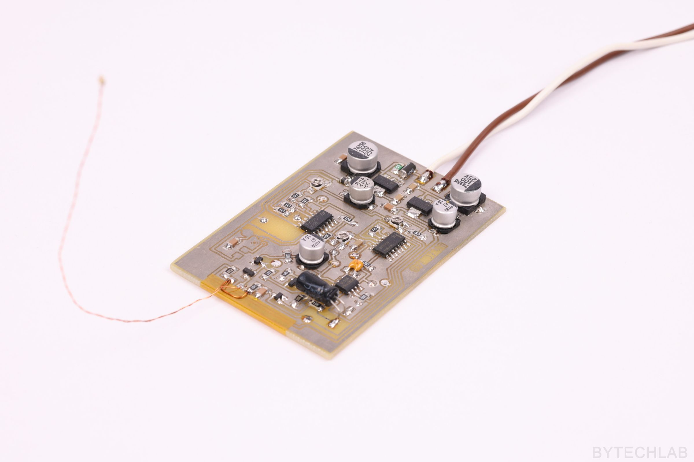

    

Wind sensitive LED (analog circuit)

### Read more at BYTECHLAB:

<table style="width: 100%; border: none;" cellspacing="0" cellpadding="0" border="0">
  <tr>
    <td></td>
    <td>https://bytechlab.com/2018/09/an-led-you-can-blow-out-like-a-candle/</td>
  </tr>
</table>

